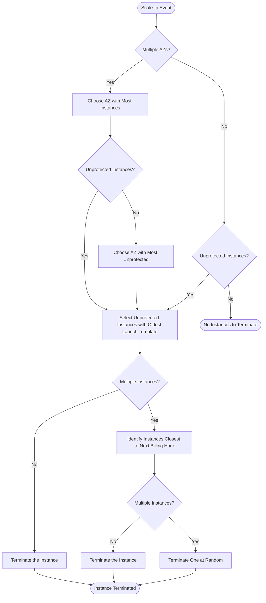

# Amazon EC2 Auto Scaling

**Amazon EC2 Auto Scaling** helps you maintain application availability and allows you to automatically add or remove EC2 instances according to conditions you define.

## Core Concepts (The Three Limits)

An Auto Scaling Group (ASG) uses three main settings to manage its size:

1.  **Minimum Size**: The absolute minimum number of instances that must be running in the group. Even if scaling policies suggest fewer, ASG will not go below this.
2.  **Maximum Size**: The absolute limit for the group. ASG will never launch more instances than this value.
3.  **Desired Capacity**: 
    - **Definition**: The target number of instances that the ASG should have running RIGHT NOW.
    - **How it works**: If an instance fails a health check or is terminated, ASG notices the count is below "Desired Capacity" and automatically launches a new one.
    - **Manual Scaling**: You can manually change the Desired Capacity to scale the group up or down.
    - **Dynamic Scaling**: Scaling policies automatically adjust the Desired Capacity based on metrics (like CPU utilization).

### Example Scenario: Min=2, Desired=3, Max=5
- **Initial State**: ASG launches **3 instances** to meet the Desired Capacity.
- **Failures**: If one instance fails, ASG immediately launches a replacement to maintain **3 instances**.
- **Scale-In**: If traffic drops and a scaling policy triggers, the ASG can decrease the Desired Capacity, but it will **stop at 2 instances** (the Minimum).
- **Scale-Out**: If traffic spikes, the ASG can increase the Desired Capacity up to **5 instances** (the Maximum).

---

## Launch Templates vs. Launch Configurations

To launch instances, an ASG needs a blueprint.

- **Launch Template (Recommended)**:
    - Supports multiple versions.
    - Allows switching between Spot and On-Demand in the same ASG.
    - Required for newer EC2 features (like T3 Unlimited).
- **Launch Configuration (Legacy)**:
    - Immutable (once created, cannot be modified).
    - Lacks versioning and modern feature support.

---

## Key Mechanisms

- **Health Checks**:
    - **EC2 Health Checks**: Monitoring instance status.
    - **ELB Health Checks**: Monitoring if the application behind a Load Balancer is responsive. (Recommended if using an ALB).
- **Cooldown Period**: A period where ASG stays at current capacity to let newly launched instances warm up and metrics stabilize before another scaling event.
- **Instance Warmup**: The time it takes for an instance to become ready to handle traffic.
- **Termination Policies**: Determine which instances to terminate first.

### Default Termination Policy Flow

---

## Exam Tips

- **Desired Capacity**: If a question asks how to ensure 3 instances are *always* running even if one fails, the answer is to set **Desired Capacity = 3** (and Minimum = 3).
- **Health Checks**: If instances are running but the application is failing, ensure the ASG is using **ELB Health Checks**, not just EC2 Health Checks.
- **Scaling Policies**: Refer to [scaling_policy_comparison.md](file:///Users/qy/skyro/aws-saa_c03/services/scaling_policy_comparison.md) for details on Target Tracking vs. Predictive scaling.
- **Availability**: ASG always tries to balance instances across the **Availability Zones** configured for the group.
